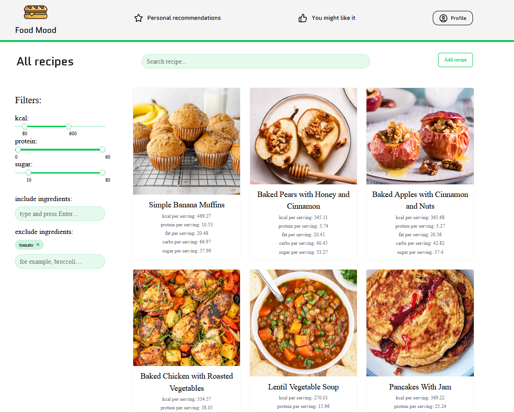
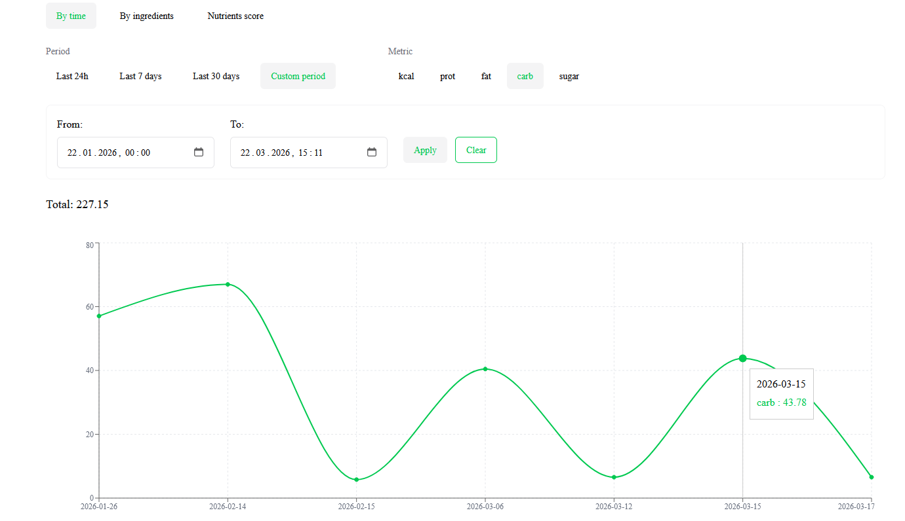
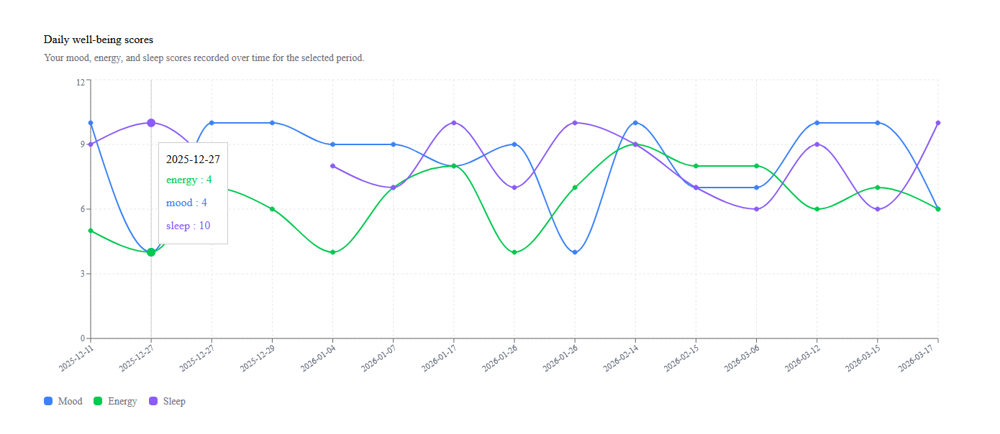
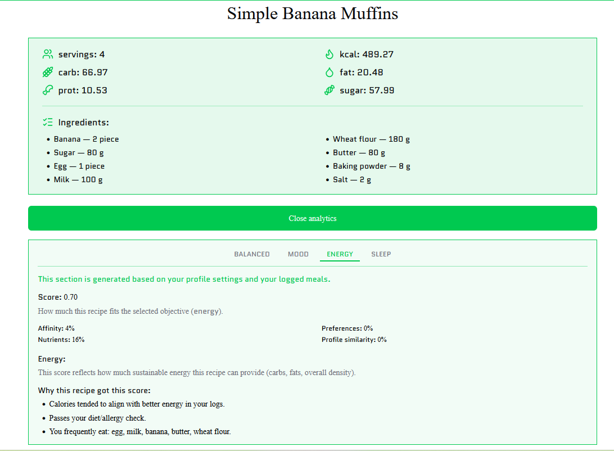

# 🍽️ Food Mood

Full-stack app that analyzes your meals and personal data to deliver personalized nutrition insights and recipe recommendations.

## 🔗 Links

* 🌐 App: https://food-mood-lime.vercel.app
* 📄 API Docs (Swagger): https://food-mood-cb8f.onrender.com/api

> ⚠️ The backend is hosted on Render (free tier), so the first request may take ~30–60 seconds to wake up.

## ✨ Features

* Recipe analysis with automatic nutrition breakdown (powered by USDA API)
* Meal tracking with personal health data (age, BMI, preferences, allergies)
* Recipe rating based on mood, energy, and sleep
* Personalized recommendations based on your eating habits and metrics
* Interactive dashboard with charts and nutrient correlations
* Secure authentication (JWT + Google OAuth)
* File storage with Supabase (e.g. recipe assets)
* Fully documented API with Swagger

## ⚙️ Tech Stack

**Frontend**

* Next.js (App Router, TypeScript)
* Tailwind CSS + shadcn/ui
* React Hook Form + Zod
* TanStack Query
* Recharts (data visualization)
* Orval (API client generation)

**Backend**

* NestJS (TypeScript)
* PostgreSQL + Prisma
* Supabase (DB + Storage)
* JWT + Google OAuth (Passport)
* Swagger (API docs)
* Jest (testing)
* USDA API (nutrition data)
* Docker

**Deployment**

* Frontend: Vercel
* Backend: Render

## 🧩 Architecture

The frontend follows Feature-Sliced Design (FSD), organizing code into layers and features to improve scalability, maintainability, and separation of concerns.

## 🚀 Run locally

```bash
git clone https://github.com/Flanele/food_mood.git
cd food_mood
cp server/.env.example server/.env
cp client/.env.example client/.env
docker compose up --build
```

## 📸 Preview





